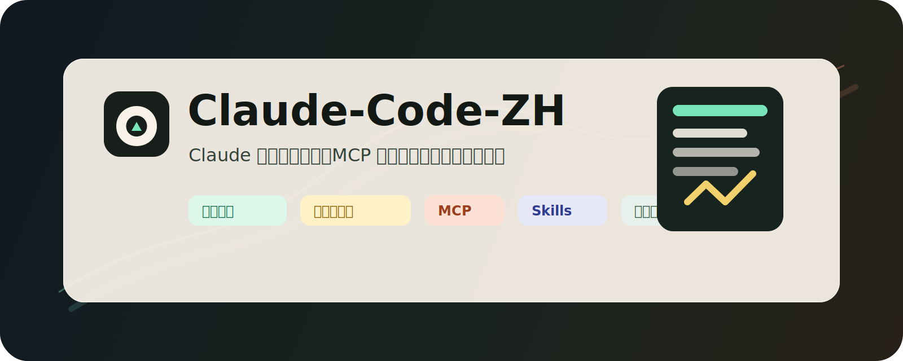

# Claude-Code-ZH



Claude Desktop / Claude Code 中文化、优化和第三方模型接入指南。

把这个仓库链接发给任意 AI 编程工具，让它先读 [`AI_AGENT_GUIDE.md`](AI_AGENT_GUIDE.md)，它就能按本项目的流程帮你安装 Claude、汉化界面、配置第三方模型网关、迁移 MCP / skills，并在关键步骤向你确认。

## 本项目能解决哪些问题？

### 装了 Claude Desktop / Claude Code，却全是英文？

本项目提供安全汉化流程：先备份，再按完整字符串替换 UI 文案，最后用 `node --check` 和 Claude 日志确认没有改坏。

### 想在 Claude Code 上使用第三方模型？

本项目整理了 Anthropic 兼容网关的接入方式：HTTPS、base URL、模型别名、API key、流式与非流式请求验证，以及 Claude 日志里的健康判断。

### 想把 Codex / OpenCode / 其他 agent 的 MCP 迁到 Claude？

本项目提供 MCP 分类、迁移模板和协议级 smoke test。不是“配置里写上就算成功”，而是实际跑 `initialize` 和 `tools/list`。

### Claude 报 `MCP server disconnected`？

本项目提供 Windows 下常见原因排查：`.cmd` 启动方式、stdout 脏输出、Python 环境错位、远程服务不可达、token 缺失、GUI app 环境变量缺失。

### 想把 skills 给 Claude 用？

本项目说明了为什么不要用 Windows 快捷方式 / junction 伪装 skills，并提供实目录同步和重复检查脚本。

## 你需要准备什么？

必需：

- Windows 10 / 11。
- PowerShell 5.1 或 PowerShell 7。
- Git。
- Node.js 18+，用于 `node --check` 和常见 Node MCP。
- 官方 Claude Desktop 或 Claude Code。

按需：

- GitHub CLI：如果需要自动建仓、推送或接入 GitHub MCP。
- Docker：只有当你要自己部署 NewAPI、模型网关、反代、数据库或本地服务时才需要。单纯汉化 Claude 不需要 Docker。
- Tailscale / Caddy / Nginx / IIS：只有当你的第三方模型网关需要 HTTPS 域名入口时才需要。
- Python 3.10+：只有当你的 MCP 或工具链依赖 Python 时才需要。
- API key：第三方模型网关、GitHub、搜索服务等各自需要自己的 key。不要提交到仓库。

## 官方安装入口

- Claude Desktop 下载：[claude.com/download](https://claude.com/download)
- Claude Code 文档：[docs.anthropic.com/en/docs/claude-code](https://docs.anthropic.com/en/docs/claude-code)
- Claude Code 设置：[docs.anthropic.com/en/docs/claude-code/settings](https://docs.anthropic.com/en/docs/claude-code/settings)
- Claude Code MCP：[docs.anthropic.com/en/docs/claude-code/mcp](https://docs.anthropic.com/en/docs/claude-code/mcp)
- Desktop Extensions / MCPB：[claude.com/docs/connectors/building/mcpb](https://claude.com/docs/connectors/building/mcpb)

## 给 AI 工具的一句话

把下面这段连同仓库链接发给你的 AI 工具：

```text
请打开这个仓库，先阅读 AI_AGENT_GUIDE.md 和 README.md。按指南帮我安装/检查 Claude Desktop 与 Claude Code，备份配置，汉化界面，配置第三方模型网关，迁移可验证的 MCP 和 skills。涉及安装软件、写入配置、接入 API key、修改 Claude app 文件、迁移高风险 MCP、重启 Claude、推送 GitHub 前，必须先向我确认。不要读取或输出 secrets、tokens、.env、credentials、private keys。
```

## 快速执行

1. 备份 Claude 配置：

```powershell
.\scripts\Backup-ClaudeConfig.ps1 -BackupRoot .\backups
```

2. 检查一个 MCP 是否真能工作：

```powershell
.\scripts\Test-McpServer.ps1 -Command "cmd" -McpArgs @("/c", "context7-mcp.cmd", "--transport", "stdio")
```

3. dry-run 同步 skills，确认不会用快捷方式：

```powershell
.\scripts\Sync-ClaudeSkills.ps1 -Source "$HOME\.codex\skills" -Destination "$HOME\.claude\skills" -DryRun
```

4. dry-run 汉化 Claude app：

```powershell
.\scripts\Patch-ClaudeI18n.ps1 `
  -ClaudeAppRoot "C:\Path\To\ClaudeApp" `
  -TranslationFile .\translations\zh-CN.sample.json `
  -DryRun
```

5. 发布或分享前检查是否误带私有内容：

```powershell
.\scripts\Test-ClaudeProjectHygiene.ps1
```

## 推荐阅读顺序

- [`AI_AGENT_GUIDE.md`](AI_AGENT_GUIDE.md)：给 AI agent 的自动执行协议。
- [`docs/install-claude.md`](docs/install-claude.md)：安装 Claude Desktop / Claude Code。
- [`docs/preparation.md`](docs/preparation.md)：准备项、依赖和确认点。
- [`docs/i18n.md`](docs/i18n.md)：汉化策略。
- [`docs/third-party-gateway.md`](docs/third-party-gateway.md)：第三方模型网关。
- [`docs/mcp-migration.md`](docs/mcp-migration.md)：MCP 迁移。
- [`docs/verification.md`](docs/verification.md)：验收清单。

## 安全边界

这个仓库不应该包含：

- 你的真实 `~/.claude.json`。
- 你的真实 `claude_desktop_config.json`。
- API key、token、cookie、private key、`.env`。
- 私有 skills 内容。
- 私有 MCP 配置。
- 本机日志、截图、网关地址或内网 IP。

如果你要公开 fork 或发布自己的版本，先运行：

```powershell
.\scripts\Test-ClaudeProjectHygiene.ps1
git diff --check
git status --short
```

## 项目状态

这是一个中文优先的 Claude 维护指南项目。它不替代官方安装器，也不承诺适配所有 Claude Desktop 版本。Claude 的打包路径、JS chunk、MCP 机制和设置字段可能随版本变化；每次修改都应先备份、dry-run、验证，再进入下一步。
